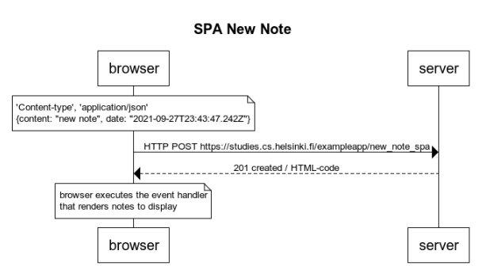

# SPA New note Diagram

```
title SPA New Note

note over browser:
'Content-type', 'application/json'
{content: "new note", date: "2021-09-27T23:43:47.242Z"}
end note


browser->server: HTTP POST https://studies.cs.helsinki.fi/exampleapp/new_note_spa

server-->browser: 201 created / HTML-code 


note over browser:
browser executes the event handler
that renders notes to display
end note
```

